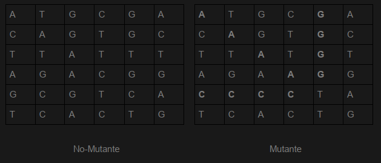
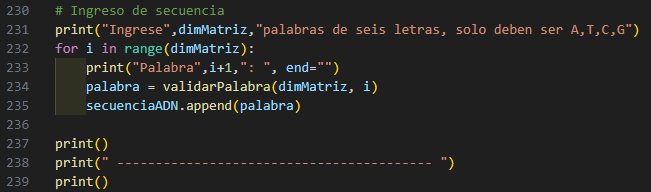

# PROGRAMACIÓN I
* Franco Garay
* DNI: 39603558
* Legajo: 51541
* francogaray2314@gmail.com

## Tecnicatura universitaria en programación - UTN

## Proyecto global - Mutantes 

Magneto quiere reclutar la mayor cantidad de mutantes para poder luchar contra los X-Mens.

Para eso se solicita crear un programa con un método o función con la siguiente función:

        boolean isMutant(String[] dna)

En donde recibirá como parámetro un array de Strings que representan cada fila de una matriz con la secuencia del ADN. Las letras de los Strings solo pueden ser: (A,T,C,G), las cuales representa cada base nitrogenada del ADN.

Sabrás si un humano es mutante, si encuentras **MÁS DE UNA SECUENCIA** de cuatro
letras iguales, de forma oblicua, horizontal o vertical

## Desarrollo

Para el desarrollo del programa se utilizó Python sin ningún tipo de librerías.

El usuario podrá ingresar la cantidad de filas que tendrá la matriz, se le pedirá el ingreso de letras que pasarán por un proceso de validación para respetar la dimensión de la matriz y cumplir con las letras obligatorias.

Se presentará la matriz creada gracias a los datos ingresados por el usuario

El programa determina la existencia de secuencias repetidas de cuatro letras e indica la localización de las mismas en la matriz.

Al finalizar el programa arrojará si la secuencia ADN corresponde a una persona mutante o no.

## Ejemplos de casos

Para probar el funcionamiento del programa puede ejecutarlo ingresando manualmente cada una de las palabras o sino puede seguir los siguientes pasos para agilizar la prueba: 

1. ***Comente la siguientes líneas de código:***

2. *Para obtener como resultado una persona **NO MUTANTE** en una matriz de dimensión **6x6** ingrese la siguiente secuencia debajo de las líneas comentadas del paso anterior:*

        secuenciaADN = ["ATTGCC", "GCTAAC", "TTCAAG", "CCGTTA", "ACTGGC", "TTGCAA"]

3. *Para obtener como resultado una persona **MUTANTE** en una matriz de dimensión **6x6** ingrese la siguiente secuencia debajo de las líneas comentadas del paso 1:*

        secuenciaADN = ["ATGCGA", "CAGTGC", "TTATGT", "AGAAGG", "CCCCTA", "TCACTG"]

***

